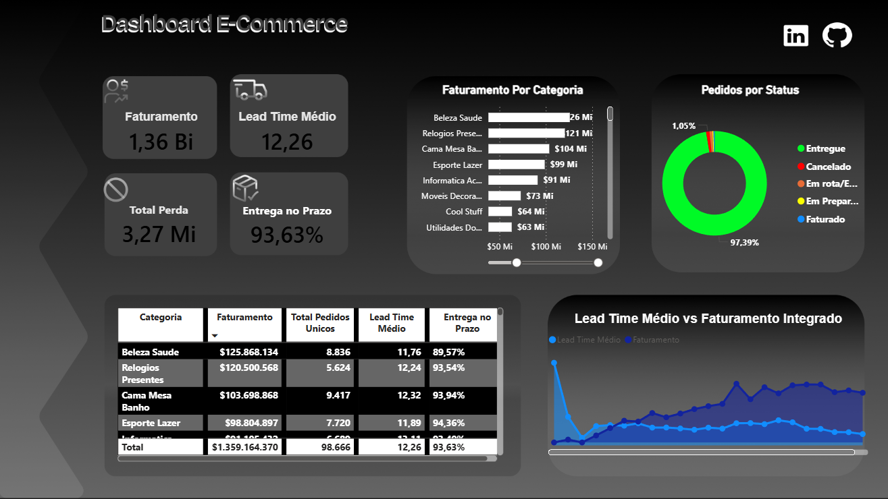

📊 Dashboard E-Commerce — Power BI

📌 Sobre o projeto
Dashboard interativo de E-Commerce desenvolvido do zero, cobrindo todas as etapas do processo de análise de dados — desde o tratamento dos dados brutos até a visualização final no Power BI.
O projeto utiliza um modelo dimensional com tabelas de fato e dimensão, relacionamentos entre 7 tabelas e medidas DAX para cálculo dos principais KPIs do negócio.

🛠️ Ferramentas utilizadas

Microsoft Excel — organização e estruturação inicial dos dados
Power Query (Excel e Power BI) — tratamento e limpeza dos dados, padronização de tipos, remoção de inconsistências e transformação de colunas DateTime para Date
Power BI Desktop — modelagem dimensional, criação de relacionamentos e desenvolvimento dos visuais
DAX — criação de medidas calculadas e tabela calendário

🗂️ Estrutura do modelo de dados

O modelo segue a arquitetura Star Schema com as seguintes tabelas:
Tabelas Fato

Fatos_Vendas — transações de vendas com preço, frete e datas
Fatos_Logistica_Status — status e datas de entrega dos pedidos
Fatos_Pedidos_Produtos — itens por pedido com informações de produto

Tabelas Dimensão

Dim_Calendario — calendário contínuo criado via DAX
Dim_Produtos — catálogo de produtos e categorias
Dim_Clientes — cadastro de clientes
Dim_Geolocalização — dados geográficos por CEP

📈 KPIs e métricas
MétricaValorFaturamento Total$1,36 BiLead Time Médio12,26 diasTotal de Perdas$3,27 MiTaxa de Entrega no Prazo93,63%Pedidos Entregues97,39%Total de Pedidos98.666

🔍 Principais insights

Beleza & Saúde é a categoria com maior faturamento — $125,8 Mi com 8.836 pedidos
Relógios & Presentes tem o menor Lead Time médio entre as top categorias — 12,24 dias
A taxa de cancelamento é baixa — apenas 1,05% dos pedidos
O faturamento apresenta tendência de crescimento ao longo do período analisado (2016–2018)

⚙️ Principais desafios técnicos

Tabela calendário com lacunas — a Dim_Calendario original tinha datas faltando, impedindo o Power BI de marcar a tabela como calendário oficial e propagando filtros incorretamente. Solução: recriação via DAX com CALENDAR() e intervalo fixo
Datas em formato DateTime — as colunas de data nas tabelas de fato estavam com hora (DateTime), impedindo o relacionamento correto com a tabela calendário. Solução: conversão para Date via Power Query (Transformar → Data → Somente Data)
Relacionamento inativo — o relacionamento entre Fatos_Logistica_Status e Dim_Calendario estava inativo. Solução: ativação do relacionamento após correção dos tipos de data
Filtro de categoria não propagando para Perda — o gráfico usava Nome_Categoria de Fatos_Pedidos_Produtos em vez de Dim_Produtos, impedindo o cross-filtering. Solução: substituição pelo campo da dimensão correta

📊 Visuais do dashboard

Cards de KPIs com cross-filtering interativo
Gráfico de barras — Faturamento por Categoria
Gráfico de rosca — Pedidos por Status
Gráfico de área — Lead Time Médio vs Faturamento ao longo do tempo
Tabela detalhada por categoria com Faturamento, Pedidos, Lead Time e Taxa de Entrega

👤 Autor
Nicollas Santos Ricarte
